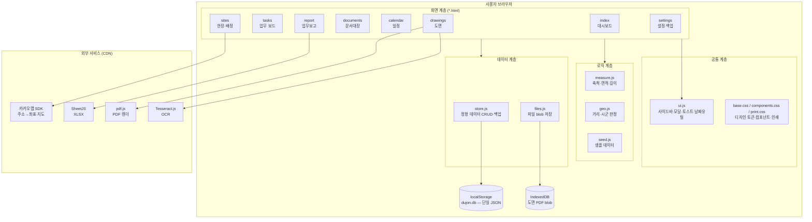
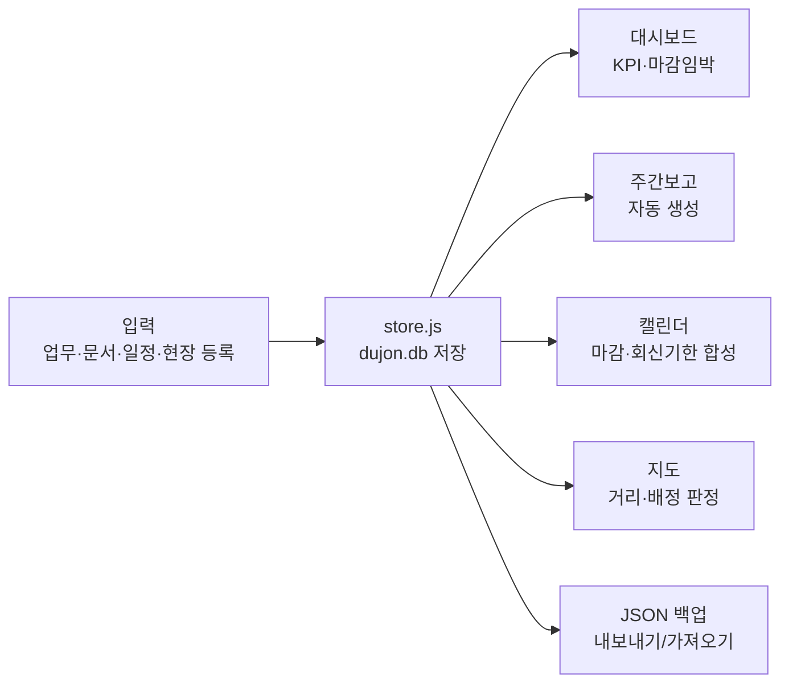
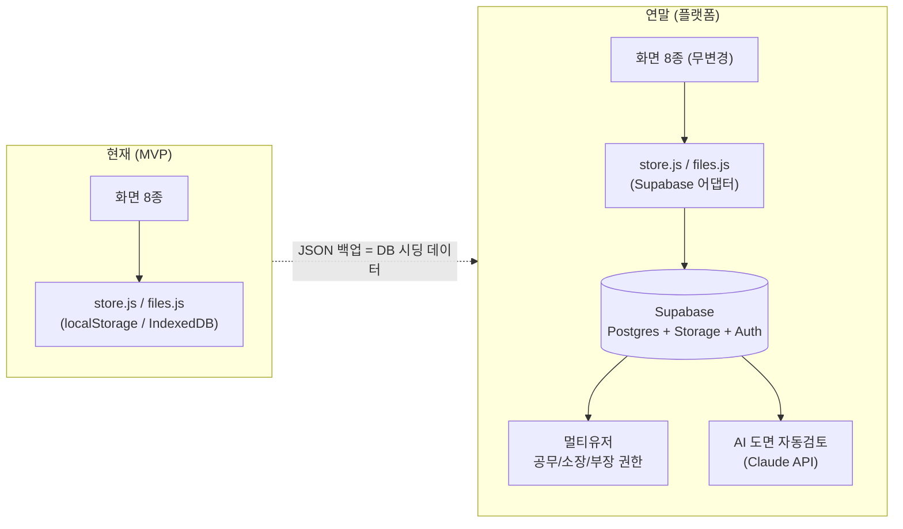

# 시스템 아키텍처 (ARCHITECTURE)

> dujon_nice — 공무팀 업무관리 플랫폼의 구조 설명서.
> 변경 시 이 문서를 먼저 수정하고 코드를 따라가게 한다. (RULES.md §7)

## 1. 전체 구조

정적 웹앱(빌드 없음). 모든 처리는 사용자 브라우저 안에서 일어나고,
데이터는 브라우저 저장소(localStorage/IndexedDB)에 보관된다. 서버가 없다.

## 2. 데이터 흐름 — 단일 진실 원천

모든 화면은 같은 DB(`dujon.db`)를 읽고 쓴다. 입력은 한 곳에서, 활용은 여러 화면에서.

## 3. 데이터 계층 상세

### store.js — 정형 데이터

- 저장 위치: `localStorage["dujon.db"]` — **schemaVersion을 가진 단일 JSON 객체**
- 구조: `{ schemaVersion, meta, sites, people, tasks, documents, events, reports, drawings, measurements }`
- 공개 API (이 시그니처가 계약이다 — 어댑터 교체 시에도 유지):
  - `load()` / `save(db)` / `migrate(db)`
  - 컬렉션별 `list(col, filter?)` / `get(col, id)` / `add(col, obj)` / `update(col, id, patch)` / `remove(col, id)`
  - `exportJSON()` / `importJSON(obj)`
- ID: `crypto.randomUUID()`. 모든 엔티티에 `createdAt`/`updatedAt` (ISO 8601).
- 엔티티 필드 정의는 `docs/DATA_SCHEMA.md` 참조.

### files.js — 파일 (도면 PDF)

- 저장 위치: IndexedDB `dujon-files` DB (localStorage 용량 한계 회피)
- 공개 API: `putFile(id, blob)` / `getFile(id)` / `deleteFile(id)` / `listFileIds()`
- 파일 메타데이터(현장, 공종, 차수 등)는 store.js의 `drawings` 컬렉션에 저장. blob만 IndexedDB.

## 4. 외부 서비스 연동 원칙

- 전부 CDN/브라우저 SDK — 서버 불필요. 로드 실패 시 해당 기능만 비활성화하고 안내 (RULES.md §1).
- 카카오맵 키는 사용자가 settings에서 입력 → localStorage 보관. 키 없으면 지도 영역에 안내 문구, 표 기능은 정상 동작.

## 5. 연말 확장 경로 (2026-12 공사부 플랫폼)

핵심: **화면 계층은 그대로 두고 데이터 계층만 교체한다.**

- Supabase 테이블 = `DATA_SCHEMA.md`의 컬렉션 1:1 매핑 (`*Id` 필드가 그대로 FK).
- 멀티유저 시 `orgId`, `createdBy` 컬럼 추가.
- JSON 백업 파일 포맷 = DB 덤프 포맷 → 시딩 스크립트가 거의 공짜.

## 6. 파일 맵

| 경로 | 역할 |
|---|---|
| `index.html` | 대시보드 (KPI, 마감 임박, 다가오는 일정) |
| `tasks.html` | 업무 보드 (칸반/리스트, 필터, CRUD 모달) |
| `report.html` | 주간·일일 업무보고 (자동 생성→편집→인쇄/복사/XLSX) |
| `documents.html` | 공문·문서 관리대장 |
| `calendar.html` | 월간 캘린더 (일정+업무마감+회신기한 합성) |
| `sites.html` | 현장·소장 배정현황 (카카오맵, 30km 판정) |
| `drawings.html` | 도면 모듈 (뷰어·측정·OCR·비교) |
| `settings.html` | 백업/복원, 기초정보, API 키, 내 정보 |
| `assets/js/store.js` | 정형 데이터 계층 (계약 인터페이스) |
| `assets/js/files.js` | 파일 데이터 계층 (IndexedDB) |
| `assets/js/ui.js` | 공통 UI (사이드바·모달·토스트·날짜) |
| `assets/js/measure.js` | 축척 보정·면적·길이 계산 (순수 함수) |
| `assets/js/geo.js` | 하버사인 거리·시/군 판정·카카오 연동 |
| `assets/js/seed.js` | 가상 샘플 데이터 주입 |
| `assets/css/base.css` | 디자인 토큰(CSS 변수)·reset·레이아웃 |
| `assets/css/components.css` | 카드·테이블·배지·모달·폼·칸반 |
| `assets/css/print.css` | A4 인쇄 (결재란 포함) |
