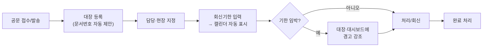
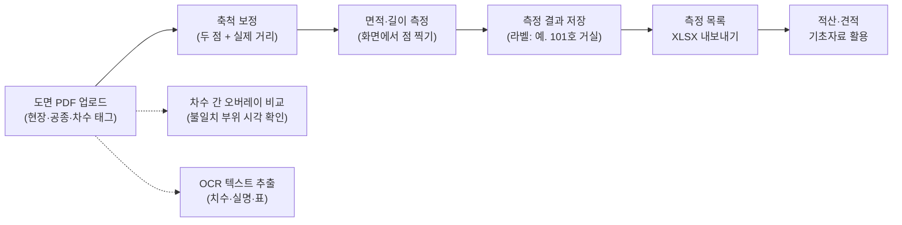
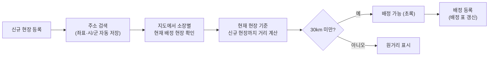
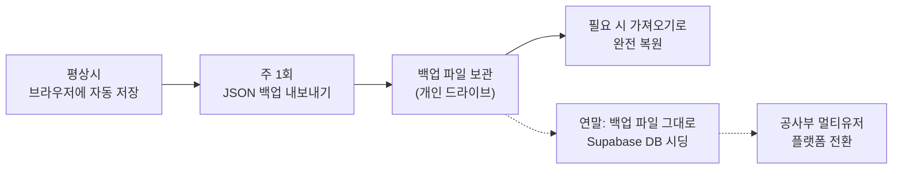

# 프로세스 플로우 (PROCESS)

> 누구나(상급자 포함) 보고 이해할 수 있는 업무 흐름도.
> 이 플랫폼이 공무팀 업무를 어떻게 처리하는지 5개 흐름으로 설명한다.

## 1. 일일 업무 흐름 — 등록에서 주간보고까지

매일 입력한 업무가 금요일 주간보고로 자동 정리된다. 보고서를 따로 쓰지 않는다.

## 2. 문서 처리 흐름 — 공문 접수에서 회신까지

## 3. 도면 검토 흐름 — 업로드에서 적산 기초자료까지

## 4. 현장소장 배정 흐름 — 30km 판정

## 5. 데이터 관리 흐름 — 백업과 플랫폼 전환

---

## 배포 전 검증 체크리스트 (RULES.md §6)

1. 전 페이지 콘솔 에러 0건 (빈 상태 포함)
2. 업무/문서/일정/현장 CRUD → 새로고침 후 유지
3. JSON 백업 내보내기 → 초기화 → 가져오기 → 완전 복원
4. 주간보고 A4 인쇄 미리보기 잘림 없음 + 텍스트 복사 정상
5. 모바일 폭(390px) 사이드바·테이블 동작
6. 상대 경로만 사용 (`/assets/...` 검색해서 0건)
7. push 후 Pages URL에서 재확인
8. 도면: PDF 업로드 → 축척 보정 → 면적 측정값 수기 계산과 일치, 새로고침 후 유지
9. 지도: 현장 2곳 등록 → 거리·시/군 표시, 30km 판정 색상, 키 미입력 시 안내 문구
